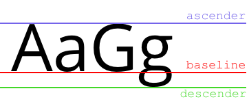
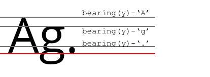

## Baseline Policy

To cover all possible baseline position configurations relative to coordinate system origin the concept of **baseline policy** is introduced.

Familiarity with the following terms is useful for the further reading:

- 'baseline'
- 'ascender (line)'
- 'descender (line)'
- 'bearing'

The first three metrics are properties of the entire font face, whereas 'bearing' is a property of a single glyph.

Consult [README](README.md) for more information, here is just a visual overview:

Baseline Policy types in Octopus3+ and 'Textify':

- `SET`
- `CENTER`
- `OFFSET_ASCENDER`
- `OFFSET_BEARING`

### `SET`

The first baseline starts exactly in the origin.

![SET]

### `CENTER`

The first baseline is shifted such that the text is centered within the line height (there's a gap of the same size above ascender line and bellow the descender line).

![CENTER]

### `OFFSET_ASCENDER`

The first baseline is shifted by the height of the first ascender line.

![OFFSET_ASCENDER]

### `OFFSET_BEARING`

While the previous types are agnostic of the actual content as the relevant metrics are property of the font face, `OFFSET_BEARING` shifts the baseline by the larges 'bearing' value of any glyph at the line.

So, for the same text transformation the following situation might happen:

![OFFSET_BEARING1]
![OFFSET_BEARING2]
![OFFSET_BEARING3]

[OFFSET_ASCENDER](img/OFFSET_ASCENDER.png) "OFFSET_ASCENDER"
[OFFSET_BEARING1](img/OFFSET_BEARING1.png) "OFFSET_BEARING"
[OFFSET_BEARING2](img/OFFSET_BEARING2.png) "OFFSET_BEARING"
[OFFSET_BEARING3](img/OFFSET_BEARING3.png) "OFFSET_BEARING"
[CENTER1](img/OFFSET_CENTER1.png) "CENTER"
[CENTER2](img/OFFSET_CENTER2.png) "CENTER"
[SET](img/SET.png) "SET"

